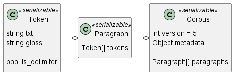
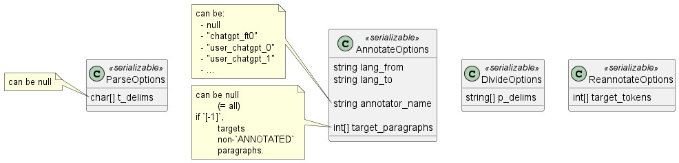
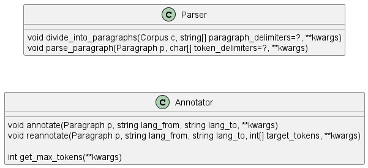

# 설계

## Frontend

### UI


Proof-of-Concept 참조.

- `Preview` 버튼은 문단과 관련된 기능을 위한 것임. (`UC003` & `UC004` 참조)
  - 구현 전에는 버튼이 눌리면 에러 메세지를 띄울 것.
- 메세지창은 제거하지 않으면 계속 쌓임.

### Tokens
- Token은 클릭으로 선택/비선택을 toggle할 수 있음.
- Token에 마우스를 hover하면 희미한 회색의 버튼 (역삼각형 모양)이 뜨며, 이를 누르면 "수정" 등의 액션 (cf. `UC012`)이 있는 드롭다운이 나타나야 함.

## Backend

### Endpoints
e.g. `http://localhost/api/v2/annotator/annotate`

#### /api/v2
- `POST /upload`
  - Req: `"corpus"` *or* `"original_text"`*, not both*
  - Res: `"corpus_id"`

- `POST /parser/divide`
  - Req: `"corpus_id"`, `"divide_options"`
  - Res: `"task_id"`
- `POST /parser/parse`
  - Req: `"corpus_id"`, `"parse_options"`
  - Res: `"task_id"`

- `POST /annotator/annotate`
  - Req: `"corpus_id"`, `"annotate_options"`
  - Res: `"task_id"`
- `POST /annotator/reannotate`
  - Req: `"corpus_id"`, `"annotate_options"`, `"reannotate_options"`
  - Res: `"task_id"`

- `GET /tasks/<id>`
  - Res: `"status"`, `"target_corpus_id"`
- `GET /tasks/<id>/abort`
  - Res: `"success": true`
  - Note: Only effective when task.status is in [`READY`, `RUNNING`]

- `GET /corpuses/<id>`
  - Res: `"corpuses_history"`

- `GET /login` (redirection)
- `GET /logout` (redirection)

## Classes

### Serializable


### Req. options


- On `/annotator/reannotate`, the fields of `AnnotateOptions`:
  - `target_paragraphs` is ignored
  - The other fields can be null can be null (will use the previous one)

```json
	"reannotate_options": {
		"target_tokens": {
			2: [3, 4],
			4: [0]
		}
	}
```
For `annotator/reannotate`, `AnnotateOptions.target_paragraphs` is ignored

### Manipulators


```python
class Parser: 
  def divide_into_paragraphs(c: Corpus, paragraph_delimiters=?: list[str], **kwargs) {
      c.p_div_locs = [p0, p1, p2, ...]
      c.paragraphs = [
          Paragraph(original_text=c.original_text[p:q], pstate="DIVIDED")
          for p, q
          in the sequence of the c.p_div_locs
      ]
  }

  def parse_paragraph(p: Paragraph, token_delimieters=?: list[char], **kwargs):
      p.tokens = [Token() ...]
      p.pstate = "PARSED"
      p.token_delimieters = token_delimiters


class Annotator:
	def annotate(p: Paragraph, lang_from: str, lang_to: str, **kwargs):
		if not p.is_delimiter:
			for token in p.tokens:
				if token.is_delimiter:
					continue
				token.gloss = ...

		p.pstate = "ANNOTATED"
		p.annotator_info = ...
```


## Seq.


## ER


`TaskInfo.status` is in [`READY`, `RUNNING`, `FINISHED`, `ERROR`, `ABORTED`]

## Deprecated

### v3
#### ER


### v2
#### Backend


```python
class Task:
	def run(self, func, data):
		self.status = "RUNNING"

		uploaded_corpus = get from self.target_corpus_id
		uploaded_corpus.current_task = task_id

		# Run the task
		func(args) 
			#newcorpus.task_ids.append(task_id)
			#uploaded_corpuzs.corpuses_history.append(newcorpus)

		#After the task is completed:
		uploaded_corpus.current_task = None
		self.status = "FINISHED"
```
- **TODO**: Change the model and seperate the array fields (in the next iteration)

### v1
#### Endpoints
- `POST /v1/glosses/annotate`
  - 
  - Returns the "Result JSON" below

#### Result JSON


[Week 2](/docs/weekly/week2.md) 참조.

- `paragraph_delimiters`: *list of strings*: 문단을 나누는 문자열
- `paragraphs`: *list of objects*
  - `is_delimiter`: *boolean*: 문단을 나누는 문자열인지 여부 (예: newline)
  - `token_delimiters`: *string (of chars)*: 토큰을 나누는 문자들
  - `tokens`: *list of objects*
    - `txt`: *string*: 단어
	- `is_delimiter`: *boolean*: 토큰이 delimiter인지 여부
	- `gloss`: *string or null*: 번역물.
	  - `"!UNKNOWN"`: 번역물 제공 실패
	  - `"!CONTINUED"`: 이전 gloss에서 이어짐. (*예시: `["fishing", "rod"]` ~ `["낚시대", "!CONTINUED"]`*)
