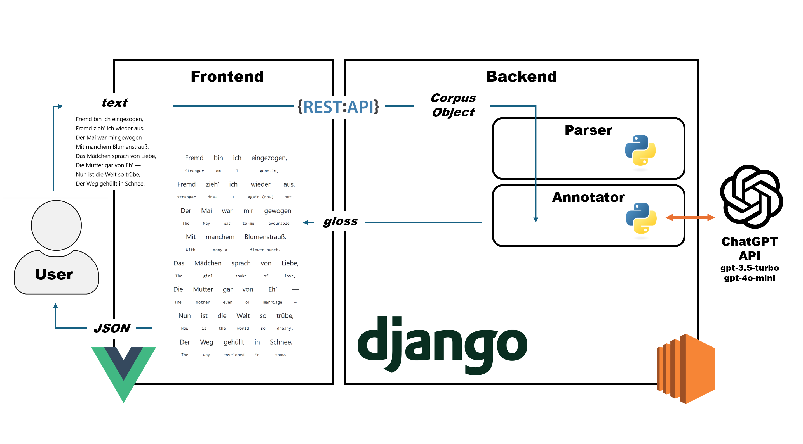

# 발표

## Title
Interlinear translation 웹앱
카페인 팀

## Interlinear translation?

*Æsop’s Fables, as Romanized By Phædrus: with a Literal Interlinear Translation* (1832)

- 언어학에서 주로 쓰임
- 언어학습 용도로도 쓰임 (문헌 예시)
  - 문법책 + 사전의 대안

## The problem to solve
- 문헌이 제한적.
  - 원하는 텍스트를 이용할 수 없다

## 개발 팀
- WBS, RNR

## 주석 달기: The Annotator

- LLM을 이용하여 단어 당 주석(gloss)을 획득
- 개발 초기엔 `gpt-3.5-turbo` 사용

- 포맷 형식: LLM이 구조structure를 지키도록 해야 함.
- 프롬프트

## 파인 튜닝
- `gpt-3.5-turbo`와 `gpt-4o-mini`를 파인튜닝 함.
- 여러 퍼블릭 도메인 문헌을 데이터로 가공.
- 낮은 토큰 사용률 (즉, 더 낮은 리소스)와 높은 성공률

## 시스템 구조

### 1. 프론트엔드
- 사용자로부터 텍스트를 입력받는다.
- 입력받은 텍스트를 백엔드로 전달한 뒤, 주석이 달린 결과물을 사용자가 읽기 쉽게 표시한다.
- Vue.js 사용
- 중요성
### 2. 백엔드
- 텍스트를 Interlinear translation에 최적화된 형태로 분해한 후 LLM과 API로 통신하여 주석을 첨가함.
- Django 사용 및 AWS deploy
- REST API

## 포맷 형태
- JSON: 백엔드와 프론트엔드가 공유하는 형태
- 프론트엔드 단에서 사용자가 다운로드 할 수 있게 함.
- Class diagrams
- ER

## 응용
- 결과 및 기존 문헌과의 비교

## 성능
- 차트

## 한계
- LLM 특성 상 오류 등.

## 시연영상
*3-5분 이내*

##	기대효과
19세기 문헌과 유료 서비스에 제한되어 있던 Interlinear translation 언어학습을 자연어처리로 자동화하여 쉽게 접근할 수 있고 이에 맞게 포맷된 JSON을 획득할 수 있다.

## 기타 느낀점
...
