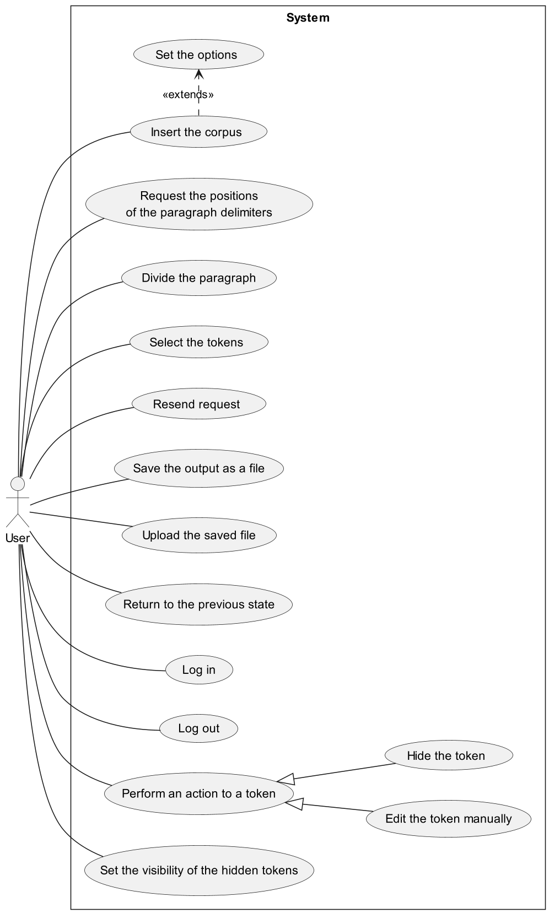

# 요구사항 분석
초안.

## Use case diagram

# Use cases
## UC001. Insert the corpus
사용자가 말뭉치를 입력함.

## UC002. Set the options
번역을 요청할 때 옵션들을 설정함. 출발/도착 언어, 엔드포인트, Parser/Annotator 선택 및 하위 설정 등

## UC003. Request the positions of the paragraph delimiters
입력된 말뭉치를 Parser가 문단 단위로 나눌 위치를 요청함.

## UC004. Divide the paragraph
사용자가 임의로 문단을 나눌 위치를 설정함.

## UC005. Select the tokens
결과물 중 일부를 선택하여 재전송 요청 등에 사용할 수 있도록 함.

## UC006. Resend request
재전송을 요청함.

## UC007. Save the output as a file
결과물을 JSON 파일 등으로 저장함.

## UC008. Upload the saved file
저장된 파일을 처리해 표시함.
- 프론트엔드 상에서 이루어져야 함.

## UC009. Return to the previous state
이전 상태로 돌아감. 즉 저장된 이전 데이터 (JSON 형태로 프론트엔드 상에 저장됨)를 불러옴.

## UC010. Log in
로그인. 또는 로그인 페이지로 리다이렉트

## UC011. Log out
로그아웃.

## UI req.
- 말뭉치 입력창 (*cf. `UC001. Insert the corpus`*)
  - 문단 표시 기능
  - 문단 표시 요청 버튼 (*cf. `UC003. Request the positions of the paragraph delimiters`*)
  - 문단 범위 임의 선택 기능 (*cf. `UC004. Divide the paragraph`*)
- 엔드포인트, 출발/도착 언어 등 옵션창 (*cf. `UC002. Set the options`*)
- 상태창: 서버에서 오는 메세지 혹은 프론트엔드 내 메세지
- 결과물 표현창
  - 단어들은 개별적으로 선택 가능 (*cf. `UC005. Select the tokens`*)
  - 읽기 편해야 함.
- 재전송 버튼 (*cf. `UC006. Resend request`*)
- 저장 버튼 (*cf. `UC007. Save the output as a file`*)
- 업로드 버튼 (*cf. `UC008. Upload the saved file`*)
- 돌아가기 메뉴 (*cf. `UC009. Return to the previous state`*)
- 로그인/로그아웃 버튼 (*cf. `UC010. Log in` & `UC011. Log out`*)