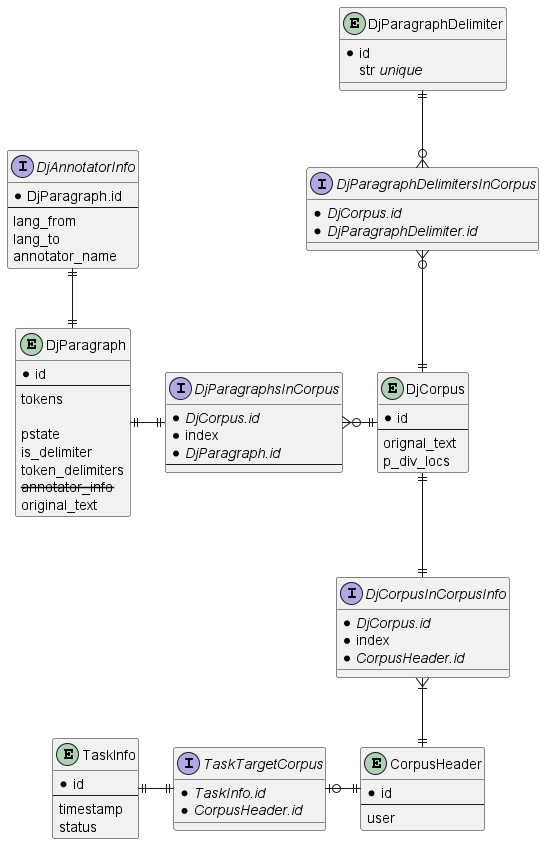

# Week 17
Design of iter-3

## 백엔드

- 1학기간 완성된 시제품을 개선하기 위해 새로운 모델 구상 요.
- 현재 작성된 Token 등의 모델이 Django를 고려하지 않은 class로 작성되어 DB에서 무결성 등의 제한조건을 검사하기 어려움.
- 따라서 Django의 Model과 호환되도록 새로 작성중.
- 현재 구현 단계.

## 프론트엔드

- 'originalSelect & glossSelect' select에 "chinese"와 "spanish"를 삭제함
- 'originalSelect & glossSelect' select에 "Deutsch"와 "French"를 새롭게 추가함
- New resultbox div = 백엔드로부터 제공받은 토큰를 유저가 최종적으로 선택하면 그 결과값을 표시하는 박스

### Error
- input-text 박스에 enter키를 사용하면 resultbox에서 "Input TEXT:"가 맨 아래에 표기되는 오류 발생.
- section, textarea 박스가 웹페이지의 크기를 줄일 때 다른 박스와는 달리 자동적으로 크기가 변경되지 않음.

### 차주 목표
- 상기된 오류 수정
- resultbox에서 각 div들의 섹터 나누기
- 토큰 기능 조작 추가
- main color Select하기
- 디자인 수정 및 보완하기