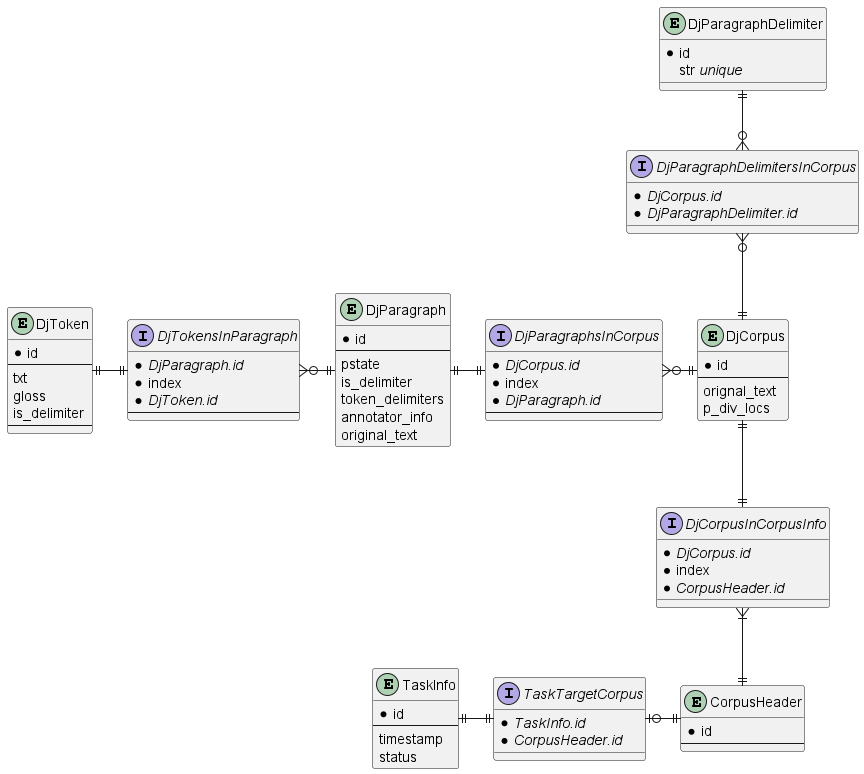

# Week 18
Impl. of iter-3 #1

## 백엔드
[`api_v3` branch, commit `7f4d2a9`](https://github.com/parkchamchi/GlossySnake/tree/7f4d2a9674a344f4ffe062a9a969fb66c5ae1138)

### 진행사항

- 저번주에 작성된 ER을 기준으로 새로운 모델 작성중. 현재 Upload 구현중. 다음주까지 기존 모델 교체가 완성될 것으로 보임.
- 현재 `api_v3` 브랜치에서 작업중이며 `master`에 푸시하기 전 기존 `v2` api와 분리할 예정.
- 프론트엔드간 인터페이스는 변화가 주지 않는 방향으로 개발중.

### 계획
모델 교체 후 `/reannotate`등 편의기능 개선 예정.

## 프론트엔드
- 입력칸을 작게 만들고 출력칸을 크게 수정함
  - 기존 textarea div를 각기 다른 div로 분할하여 크기에 차이가 있게끔 함.
  -  otheroption의 display 속성에서 none;을 삭제하여 상시 노출되도록 하였고, input-textarea + otheroption의 크기가 output-textarea의 크기와 동일하게 수정

- resultbox에서 각 입력창들의 선택/입력/결과 값(Input Text값 제외)를 볼드체로 표기하여 사용자가 선택한 값에 대한 직관성을 강조함.
- error 수정: section과 textarea box가 웹페이지의 크기를 바꾸어도 반응하지 않고 크기를 유지하던 오류 수정, 현재는 웹 페이지의 크기를 변경하면 그에 맞게 반응하게 함.

### error
- arrow box 위치 수정
- input-text box에 enter키를 사용하며 입력하면 resultbox에서 "Input Text:"가 맨 아래에 표기됨
- input- & output-textarea의 오른쪽 마감이 위 아래와 일정하지 않음.

### 차주 목표
- 상기된 오류 수정
- resultbox에서 각 div들의 섹터 나누기
- 토큰 조작 기능 추가
- main color select하기