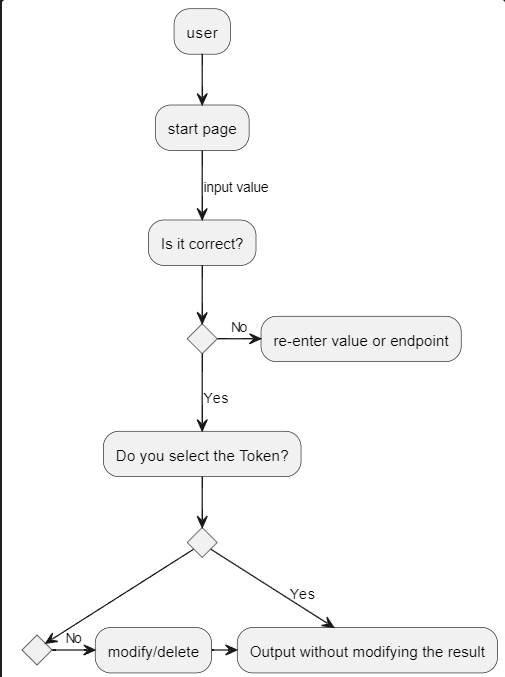

# Frontend

구동 목표
-------

*구동과정 다이어그램

* UC001
  * 로그인/회원가입 페이지 UI 제작
  * 가운데로 정렬해 페이지 제작하도록 함

* UC002
  * 사용자가 선택하는 언어 추가

* UC003
  * Token 부분 Vue로 진행해 사용자가 직접 추가/수정/삭제 기능할 수 있도록 함
  * 역삼각형 버튼 기능 구체화
  * 재전송 요청 기능 추가
  * 숨김처리된 토큰을 어떻게 기능적으로 추가할 지 생각할 것
  
* UC004
  * JSON에 파일 첨부 기능 추가

* UC005
  * main/input/output 페이지 가독성 있게 만들 수 있도록 함

* UC006
  * 저장된 JSON 파일을 처리하여 표시할 수 있도록 함

프론트엔드 수정사항
--------

* 토큰 뷰로 진행 
* 디자인 사항
   * 색상: febe98 - O
   * 박스테두리: border-radius: 10px - O -> box 크기 등 수정 요망
   *  메인 폰트 정할 것

10WEEK
----------
* **upload 통신 확실하게 구현** - △
* 백엔드 업그레이드 - O (Django 웹페이지 접속)
* 토큰 기능 구체화 - X
* 통신 실패 시 Warning Box 나오도록 수정 - O
* 그 아래 Box도 Token 출력 시 나오도록 수정 - O
* 프론트엔드 구동과정 다이어그램화 하기 - △

11WEEK
----------
* 토큰 기능 구체화
* 프론트엔드 구동과정 다이어그램화하기
* page 분할에 대한 필요성 검토와 가능한 시나리오
* Log-in page 구체화
* CreateAccount page 구체화
  
12WEEK
----------
* Single page app의 디자인 시각화 -
* 프론트엔드 다이어그램화 추가 작업 - O
* /인덱스 API 테스트 - O
* 프론트엔드 bootstrap 사용하여 디자인 - 

13WEEK
----------
* http://127.0.0.1:56123/api/v2/annotator/annotate 로 업로드 - fail to fetch 다수 발생
* Single page app 디자인 수정 - X
* 토큰 기능 구체화 - O

14WEEK 목표
---------
* /Upload 통신 구현 완료 시 바로 디자인 및 레이아웃 변경
* 입력 => 출력과 같은, 왼쪽에서 오른쪽으로 가는 형태로 변경
* 통신 구현 완료로 출력값 나올 시, 토큰 기능 함수를 삽입해 구현이 되는지 확인

15/16 WEEK 
---------
* 기말고사

SEMESTER BREAK 1WEEK
---------
* 'originalSelect & glossSelect' select에 "chinese"와 "spanish"를 삭제함.
* 'originalSelect & glossSelect' select에 "Deutsch"와 "French"를 새롭게 추가함.
* New resultbox div = 백엔드로부터 제공받은 토큰를 유저가 최종적으로 선택하면 그 결과값을 표시하는 박스.

**Error**
* input-text 박스에 enter키를 사용하면 resultbox에서 "Input TEXT:"가 맨 아래에 표기되는 오류 발생.
* section, textarea 박스가 웹페이지의 크기를 줄일 때 다른 박스와는 달리 자동적으로 크기가 변경되지 않음.

**차주 목표**
* 상기된 오류 수정.
* resultbox에서 각 div들의 섹터 나누기.
* 토큰 기능 조작 추가.
* main color Select하기.

SEMESTER BREAK 2WEEK
--------
* 입력칸을 작게 만들고 출력칸을 크게 수정함.
  * 기존 textarea div를 각각 input-textarea와 output-textarea로 분할.
  * 각 textarea의 height를 auto;로 설정하여 웹페이지 크기 축소시 자동으로 반응하는 반응형 박스가 되도록 수정함.
  * output-textarea의 경우 min-height를 147px로 설정하여 왼쪽 section과 총 크기를 맞추도록 함.
  * otheroption의 display를 none에서 노출되도록 변경.
* resultbox에서 각 입력창들의 선택/입력/결과값(Input Text제외)를 볼드체로 표기하여 직관성을 강조함.

**error**
* input-text 박스에 enter키를 사용하면 resultbox에서 "Input TEXT:"가 맨 아래에 표기되는 오류 발생.
* input-textarea와 output-textarea의 오른쪽 끝 마감이 위 아래와 일정하지 않음. 각각 위 아래 속성들과 일치하게 수정이 필요.
* arrow box의 위치 수정 필요

**차주 목표**
* 상기된 오류 수정.
* resultbox에서 각 div들의 섹터 나누기.
* 토큰 기능 조작 추가.
* main color Select하기.

SEMESTER BREAK 3WEEK
--------